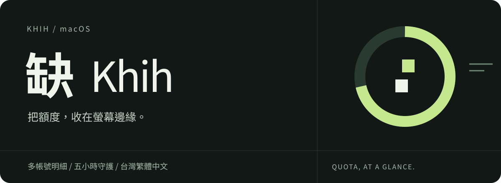
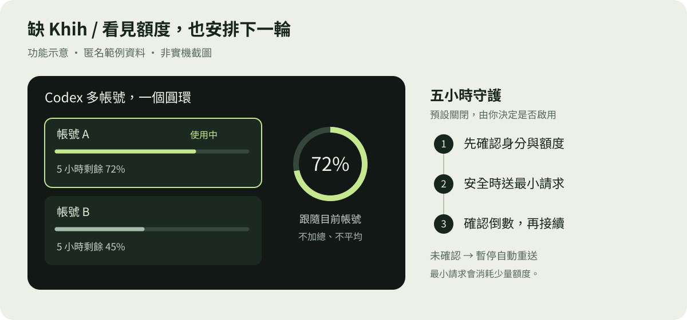

# 缺 Khih

<div align="center">



macOS 15+ · Swift · [MIT 授權](LICENSE) · [CI 執行狀態](https://github.com/lostshin/khih/actions/workflows/ci.yml)

**把程式助理的額度、工作狀態與等待提醒，收在螢幕邊緣。**



</div>

以上兩張圖為缺專案重新繪製的 SVG，依本專案 MIT 授權提供；功能圖使用匿名範例，並非實機截圖。介面設計的上游來源與致謝見下文。

「缺」是這個專案的中文名，`Khih` 是 App、程式碼與儲存庫使用的名稱。
它是一套 macOS 螢幕邊緣介面：用小型圓環顯示各個程式助理的額度，並告訴你工作階段仍在執行、已完成，或正在等你回覆。

將游標移到圓環上可以查看各時段額度、重置時間與工作階段；受管理的 Codex、Claude 與 Antigravity 帳號還能使用五小時／週額度守護，但所有會送出請求的功能都必須由使用者明確開啟或操作。

<details>
<summary>English overview</summary>

**Khih** (Chinese name: **缺**) is a macOS edge-notch interface for coding-assistant usage limits and live session states. It shows when an agent is working, finished, or waiting for you, and provides opt-in safeguards for managed five-hour and weekly quota windows.

Khih is an independent fork of [Codenotch](https://github.com/vinzdg/codenotch). It preserves Codenotch's screen-edge UI and interaction design while adding a separate quota engine, managed-account workflow, safety gates, Taiwan Traditional Chinese localization, and its own signing and release identity.

</details>

## 與 Codenotch 的關係

缺源自 [Vinz](https://github.com/vinzdg) 建立的 [Codenotch](https://github.com/vinzdg/codenotch)。螢幕邊緣的 notch、緊湊圓環、展開動態與多數互動設計，都建立在 Codenotch 的成果上。

缺目前獨立開發，和 Codenotch 的主要差異如下：

| 項目 | 缺 Khih | Codenotch |
|---|---|---|
| 專案定位 | 在原有 UI／UX 上加入主動額度守護與較嚴格的安全閘門 | 上游原作，持續發展用量顯示、工作階段與跨裝置功能 |
| 品牌與識別 | `Khih`、中文名「缺」、bundle ID `tw.lokun.khih` | `Codenotch`、bundle ID `com.vinz.codenotch` |
| Codex 多帳號 | 多個帳號合成一個 Codex 圓環，明細依帳號分組；主數字跟隨目前登入帳號 | 以 Codenotch 當下版本的設計為準 |
| 額度控制 | 手動啟動、單次預約、週守護、五小時守護；共用身分、冷卻、忙碌與防重送檢查 | 缺的 quota engine 不屬於上游 |
| 主要語言 | 台灣繁體中文為主，英文為輔 | 英文為主，另有多語在地化 |
| 更新與簽章 | 使用自己的 bundle ID；目前採 ad-hoc 建置，沒有自動更新 | 上游有自己的簽章、發行版與更新管道 |

這不是永久的逐項功能比較。Codenotch 仍持續更新；此表只說明缺為什麼需要獨立名稱、獨立發行與自己的安全責任。缺不會使用上游的更新 feed、簽章金鑰或 Developer Team，也不會把上游的後續成果寫成自己的功能。

## 主要功能

- 將額度圓環固定在螢幕上、下、左、右任一邊緣。
- 顯示額度用量、剩餘量、重置時間與讀值是否過期。
- 追蹤程式助理的工作狀態：執行中、完成、等待使用者。
- 工作完成或等待回覆時，可展開 notch、播放不同提示音，並將所屬 App 帶到前景。
- 支援多螢幕、硬體瀏海、尺寸、位置、強調色、常駐／自動收合與 Dock／選單列圖示設定。
- 對受管理帳號提供五小時與週額度守護、單次排程、活動紀錄及消耗速度估算。
- 繁體中文使用 `zh-Hant-TW`，介面與 README 採台灣慣用詞彙。

## 安裝

### 目前的發行狀態

缺目前沒有經 Apple 公證（notarization）的正式發行版，也不會假冒或沿用 Codenotch 的簽章。GitHub 的 [Package workflow](https://github.com/lostshin/khih/actions/workflows/package.yml) 成功執行後會產生 ad-hoc 簽章的 Universal 磁碟映像檔；正式 release 尚未提供時，請從原始碼建置。

需求：

- macOS 15 或更新版本
- 可讀取目前 Xcode 專案格式的 Xcode
- [XcodeGen](https://github.com/yonaskolb/XcodeGen)

建置可執行的 Release App：

```sh
brew install xcodegen
make build-ci
ditto build/ci/DerivedData/Build/Products/Release/Khih.app /Applications/Khih.app
open /Applications/Khih.app
```

若要覆蓋既有版本，請先退出正在執行的缺，避免在 App bundle 使用中途替換檔案。

`make build-ci` 會建立 ad-hoc 簽章的 Universal App，產物位於：

```text
build/ci/DerivedData/Build/Products/Release/Khih.app
```

若 macOS 將從 GitHub 下載的 ad-hoc 建置顯示為「已損壞」，請在確認來源確實是本儲存庫後，清除該 App 的 quarantine 隔離標記：

```sh
xattr -dr com.apple.quarantine /Applications/Khih.app
```

這個指令只處理 Gatekeeper 對未 notarize 下載檔的隔離標記；它不是簽章或來源驗證的替代品。

## 支援的資料來源

缺會區分資料的可信度：供應商回傳的數字標為 official（官方），本機紀錄推算標為 derived（推算），使用者自行設定的上限標為 manual（手動）。無法讀取時顯示過期、需要登入或錯誤，不用猜測值填補。

| 來源 | 讀取方式 | 性質 |
|---|---|---|
| **Claude Code** | 優先使用 Claude Code 的 `/usage`；必要時使用登入鑰匙圈內的 OAuth 憑證讀取相同 endpoint | official |
| **Cursor** | 讀取 Cursor 本機 SQLite 登入狀態，或 `cursor-agent` 的鑰匙圈登入 | official |
| **Codex** | 使用本機 Codex 登入向 ChatGPT usage endpoint 讀取五小時、週額度與其他可用視窗 | official |
| **Antigravity** | 呼叫官方 `agy -p /usage --output-format json`；背景執行會阻止 CLI 自行開啟登入頁 | official |
| **GLM** | 使用 Claude Code、ZCode 或 OpenCode 已保存的 Coding Plan key，讀取 Z.ai monitor endpoint | official |
| **Ollama Local** | 讀取本機執行環境的模型、RAM／VRAM、context 與 unload 狀態；選配中繼服務可量測速度與 thinking | local runtime |
| **Ollama Cloud** | 使用設定頁提供或環境變數中的 API key 讀取 Ollama usage endpoint | official |
| **Grok** | 使用 Grok CLI 儲存在 `~/.grok/auth.json` 的登入讀取 credits | official |
| **OpenCode** | 使用 OpenCode 登入保存的 `opencode-go` key 讀取 Go plan usage | official |
| **Command Code** | 使用 App 寫入 `~/.commandcode/auth.json` 的 key 讀取 GOAT plan billing endpoint | official |
| **GitHub Copilot** | 使用本機 GitHub CLI 登入讀取 Copilot quota；需先執行 `gh auth login` | official |
| **Gemini API** | 加總 Gemini CLI、OpenCode、Hermes 的本機 session 紀錄；不讀 API key、不連網 | derived／manual |

停用來源會停止輪詢並清除缺保存的讀值，不會登出原本的工具。Ollama Cloud 是目前唯一由缺自行保存憑證的來源；API key 存在 macOS 登入鑰匙圈，登出時刪除。

## 多帳號

### Claude Code

`~/.claude` 與 `~/.claude-<slug>` 會在啟動時自動探索。每個 Claude profile 有自己的圓環、額度與工作階段。

### Codex

缺會探索 `~/.codex`、`~/.codex-<slug>`，以及從設定頁加入的受管理帳號。多個 Codex 帳號會合成一個圓環：

- 提示卡依帳號分組顯示所有視窗；
- 目前登入帳號以強調色框線與輔助使用標籤標示；
- 主圓環顯示目前登入帳號的五小時額度；
- 找不到目前帳號時，才退回第一個有五小時讀值的帳號。

你也可以在設定頁直接新增、命名或重新命名受管理的 Codex 帳號，不必重新啟動 App。缺只讀取登入資料來確認身分，不會複製、更新或寫回 Codex 憑證。

## 五小時與週額度守護

守護功能不是一般用量輪詢。它會在安全條件成立時送出一個最小請求，用來啟動新的倒數視窗，因此會消耗少量額度，也可能同時啟動五小時與週倒數。

可用操作：

- **手動啟動五小時視窗**：只處理指定帳號或 Antigravity 群組。
- **單次預約**：每個受管理帳號各自保存一筆時間；App 關閉或睡眠期間不補送。
- **週守護**：週視窗重置後，在確認安全時送出最小請求。
- **五小時守護**：獨立總開關；視窗到期後重新檢查並接續下一輪。

兩種守護在新安裝時都預設關閉，並套用到已啟用的受管理帳號。安全規則包括：

- 首次觀測只建立 baseline（基準讀值），不送請求。
- Codex／Claude 身分無法確認時拒絕送出。
- 帳號正在使用、控制器忙碌或持有 `check.lock` 時延後。
- HTTP 429 冷卻期間不讀身分、不讀 usage，也不送請求。
- 已有倒數時不重送；週守護與五小時守護同時到期時先處理週守護，再重新確認五小時狀態。
- 請求送出前先以 atomic write 保存防重送紀錄；存檔失敗就不送。
- 後端無法確認倒數時，暫停該帳號／群組的自動重送，持續觀測；手動處理仍保留。
- Claude 五小時啟動只接受精確 endpoint 讀值，不使用只有分鐘精度的 CLI fallback。

完整安全不變量記錄在 [quota safety contract](docs/quota-safety-contract.md)。

## 工作階段提醒

程式助理結束工作或開始等你回覆時，缺可以展開五秒並播放提示音。點擊展開中的 notch 會將該工作階段所屬的 App 帶到前景。

缺能可靠識別的是 App，不一定是 App 裡的特定分頁。工作階段只提供 PID，Terminal.app、iTerm2、Warp、Ghostty 也沒有共通的分頁控制介面，因此最後一步可能仍要由你切換到正確分頁。

完成與等待可分別設定提示音；聲音走一般輸出裝置，不受 macOS「播放使用者介面音效」開關影響。第一次讀到已在執行的工作階段不會發通知，避免每次啟動都響一次。

額度跨過 80% 或到達 100% 時也可發出系統通知；每個視窗只通知一次，等視窗真正換窗後才會重新計算。

## 外觀與操作

- notch 可放在任一螢幕的四個邊緣；上下橫排、左右直排。
- 按住 Option 拖曳可沿目前邊緣移動，各邊緣分別記住位置。
- 支援多螢幕、硬體瀏海、全螢幕自動收合與不同縮放大小。
- 可選擇點擊後才顯示詳細資料，或恢復 hover 展開。
- 詳細頁可切換顯示已用／剩餘百分比，主圓環始終顯示五小時剩餘額度。
- 重置時間可顯示倒數或日期時間。
- App 可顯示 Dock icon、選單列 icon，或兩者皆不顯示。

## Ollama 本機量測

缺會自動偵測 Ollama 載入的本機模型。只要設定 endpoint，就能顯示 RAM／VRAM、context、quantization 與 unload time。

若要顯示 generation speed（tok/s）與即時 Thinking，請在「設定 → Ollama」開啟量測，並讓 client 透過缺的本機中繼服務連線：

```sh
OLLAMA_HOST=http://127.0.0.1:11435 ollama run gemma4:e4b --think
```

直接連到 Ollama 預設的 `11434` 仍可偵測模型，但沒有 response timing。中繼服務不會保存 prompt、thinking 或 reply；詳細設計見 [Ollama plan](docs/plans/2026-09-07-local-llm-provider-plan.md)。

## 資料與隱私

- 額度資料留在本機快取，失敗時保留最後成功讀值並標示過期。
- 除 Ollama Cloud 外，缺沿用各工具現有登入；不建立另一套帳號系統。
- 缺不會把 token、完整帳號 ID、fingerprint、OAuth URL 或 prompt 寫入儲存庫。
- 背景 Antigravity CLI 會封鎖瀏覽器、Apple Events 與 App 啟動路徑，避免無人操作時跳出 OAuth 登入。
- Gemini API 只讀本機工具留下的 token count，不讀 API key，也不讀 prompt 內容。
- 用量來源多半是供應商內部 endpoint、CLI 輸出或本機資料格式，供應商變更後可能失效。

## 更新

缺沒有自動更新。Codenotch 的 Sparkle feed、EdDSA 金鑰與 Developer ID 都屬於上游，若 fork 繼續指向該 feed，更新時可能被替換成 Codenotch。因此缺已移除 Sparkle；更新方式是重新下載可信任的 Khih build，或從原始碼重建。

## 開發與測試

產生 Xcode project 並執行測試：

```sh
make gen
make test-ci
```

本機 `make test` 可能選到 Apple Development 簽章；CI 與無開發者憑證的環境應使用 `make test-ci`。建立可實際啟動的 ad-hoc Release App 請用：

```sh
make build-ci
```

其他常用方式：

```sh
make run             # 產生並啟動 Debug App
KHIH_DEMO=1 make run # 使用匿名固定資料預覽介面
```

目前 macOS App 的主要架構：

- `UsageProvider`：唯讀資料來源；不允許偷偷送出 keeper request。
- `UsageStore`：輪詢、last-good 快取、來源排序、Codex 合併與畫面發布。
- `Sources/Quota/`：身分、baseline、冷卻、lock、排程、poke 與驗證。
- `NotchFleet`：每個螢幕一個 controller，將同一份讀值同步到各螢幕。
- `AppDelegate`：建立 provider、quota engine 與 UI 之間的接線。

設計規格與歷史文件：

- [介面設計規格](docs/specs/2026-08-28-usage-notch-design.md)
- [Ollama 本機模型設計](docs/plans/2026-09-07-local-llm-provider-plan.md)
- [Quota safety contract](docs/quota-safety-contract.md)
- [實作歷史](TASKS.md)

## Windows

`windows/` 內含 Rust／Tauri 2 port，沿用相同視覺方向與部分資料來源。它有獨立的程式結構、授權與第三方聲明；詳情見 [Windows README](windows/README.md)。目前本 README 的安裝與安全說明以 macOS App 為主。

## 感謝

缺之所以存在，是因為 Codenotch 已經把一個很難拿捏的介面做得很好：它安靜地待在螢幕邊緣，需要時才展開，資訊密度高，卻不會一直搶走注意力。

誠摯感謝 [Vinz](https://github.com/vinzdg) 建立並以開放原始碼分享 [Codenotch](https://github.com/vinzdg/codenotch)，也感謝每一位 Codenotch contributor。缺保留並珍惜這套 UI／UX；新增的 quota engine、安全閘門、台灣繁中內容與獨立發行責任，則由缺自行維護，不歸功或歸責於原作者。

## 授權與第三方權利

缺只納入具有可追溯授權或來源聲明的程式碼與素材：

- Codenotch 原始程式碼依 [MIT License](LICENSE) 使用，保留 `Copyright (c) 2026 Vinz`。
- 缺的修改同樣依 MIT License 發布，標示 `Copyright (c) 2026 Khih contributors (modifications)`。
- Windows port 保留 [Im-Midi (NG) 與 contributors 的 MIT 授權](windows/LICENSE)。
- Lobe Icons 的圖示依 MIT License 使用，授權原文隨 App 放在 [`LobeIcons-LICENSE.txt`](Sources/Resources/LobeIcons-LICENSE.txt)。
- SwiftNIO 依 Apache License 2.0 使用，App 同時附帶 [`SwiftNIO-LICENSE.txt`](Sources/Resources/SwiftNIO-LICENSE.txt) 與 [`SwiftNIO-NOTICE.txt`](Sources/Resources/SwiftNIO-NOTICE.txt)。
- provider 名稱與標誌可能是各公司的商標；缺僅用來識別相容服務，不表示權利人背書、合作或贊助本專案。圖示來源記錄在 [provider asset sources](docs/design/provider-assets.md)。

任何新依賴、圖片、字型或其他素材，在合併與發行前都必須確認授權相容，保留必要的 copyright／NOTICE，並實際檢查它們有進入最終 App bundle。若授權或品牌規範不清楚，就不應納入發行版。

完整授權條款見 [LICENSE](LICENSE)。
